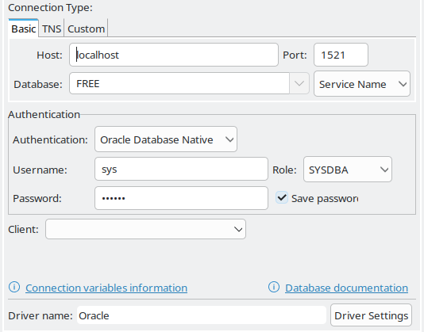
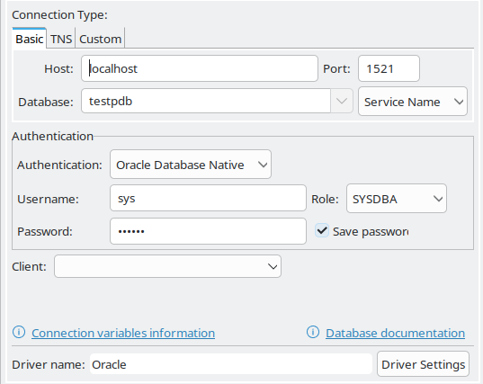
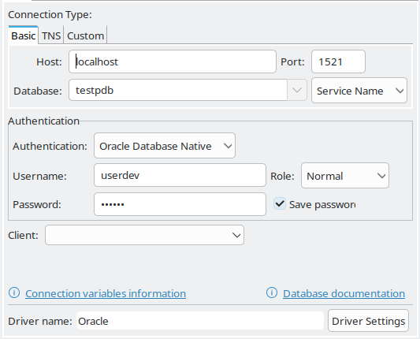

## create db

helm -n ora-db install db23cfree --set persistence=null,oracle_pwd=mypass oracle-db23c-free-1.0.0.tgz


## use dbeaver to connect to the database and create a pluggable database




use the following sql to create a pluggable database and a user with developer privileges

```sql
CREATE PLUGGABLE DATABASE testpdb 
  ADMIN USER pdb_admin IDENTIFIED BY mypass
  ROLES = (DBA)
  DEFAULT TABLESPACE users
  DATAFILE '/opt/oracle/oradata/FREE/mypdb/users01.dbf' SIZE 100M AUTOEXTEND ON
  FILE_NAME_CONVERT = ('/opt/oracle/oradata/FREE/pdbseed/', 
                      '/opt/oracle/oradata/FREE/testpbd/');

ALTER PLUGGABLE DATABASE testpdb OPEN;

ALTER PLUGGABLE DATABASE testpdb SAVE STATE;

```



use the following sql to create a user with developer privileges

```sql
-- Create the user
CREATE USER userdev IDENTIFIED BY mypass;

-- Grant connection privileges
GRANT CREATE SESSION TO userdev;

-- Grant developer privileges
-- Provides resources like CREATE TABLE, SEQUENCE, etc.
GRANT RESOURCE TO userdev;
GRANT CREATE VIEW TO userdev;
GRANT CREATE PROCEDURE TO userdev;
GRANT CREATE TRIGGER TO userdev;
GRANT CREATE SYNONYM TO userdev;
GRANT CREATE TYPE TO userdev;
GRANT CREATE SEQUENCE TO userdev;
GRANT CREATE JOB TO userdev;
GRANT SELECT ANY DICTIONARY TO userdev; -- For viewing data dictionary

-- Grant unlimited space in tablespaces
GRANT UNLIMITED TABLESPACE TO userdev;

-- Optional: Create a default tablespace for the user
-- ALTER USER userdev DEFAULT TABLESPACE users;

-- Commit the changes
COMMIT;
```



use the following sql to test the userdev privileges

```sql
CREATE TABLE test_table (id NUMBER, name VARCHAR2(50));
INSERT INTO test_table VALUES (1, 'Test entry');
SELECT * FROM test_table;

-- DROP TABLE test_table;
```
